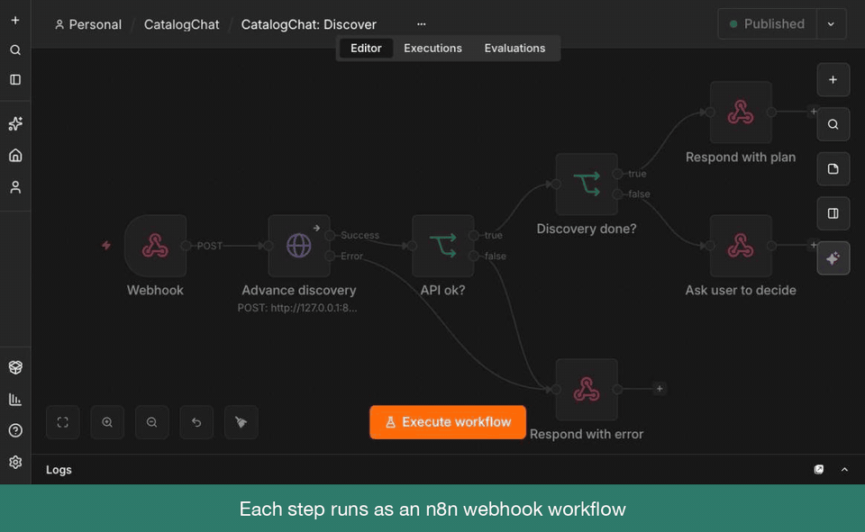

# catalogchat

Point it at a catalog website (films, products, listings) and it extracts the data into clean rows, without writing a custom scraper.
An LLM works out the page structure, walks nested listing → detail pages with you confirming each step, infers the fields, and scrapes them to CSV or JSON.

Built with Python, OpenAI, FastAPI, n8n workflows, and a Streamlit or plain-JS front end.

## Components

### 1. N8N based solution

Needs the FastAPI server (below) running on port 8080; the workflows call it.

`catalogchat: npx n8n`
runs the local n8n service in http://localhost:5678

`catalogchat: npx n8n import:workflow --separate --input=n8n/workflows`
imports (or overwrites) the workflows. Then activate all six in the n8n editor.

`catalogchat: npx serve n8n/ui`
runs the UI in http://localhost:3000 (any static server works, e.g. `python -m http.server`).
Use `?n8n=http://host:port` if n8n is not on localhost:5678.

Workflows are stateless: each user action is one webhook call, and the API keeps discovery state.

| Webhook (POST `/webhook/...`) | Workflow | API call |
|---|---|---|
| `catalogchat/start` | CacheCheck | `GET /plan` |
| `catalogchat/discover` | Discover | `POST /plan/discovery` |
| `catalogchat/schema` | Schema | `PUT /plan` |
| `catalogchat/sample` | Sample | `POST /plan/extraction-plan`, `POST /plan/sample` |
| `catalogchat/fix/suggest`, `catalogchat/fix/apply` | FieldFix | `POST /plan/suggest-correction`, `POST /wait_response` |
| `catalogchat/scrape` | Scrape | `POST /plan/scrape` |

### 2. FastAPI server + Streamlit UI solution

`catalogchat: uvicorn api.server:app --reload --port 8080`
runs the FastAPI server in http://127.0.0.1:8080

`catalogchat: python -m ui.run`
runs the UI in http://localhost:8501

